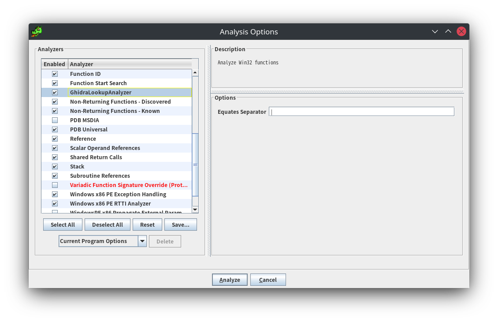
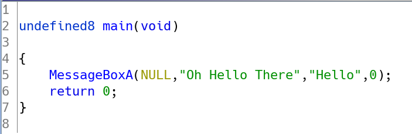
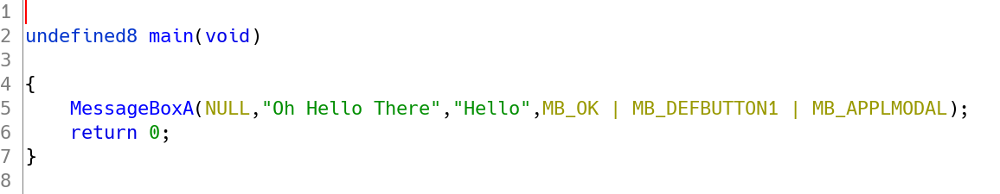
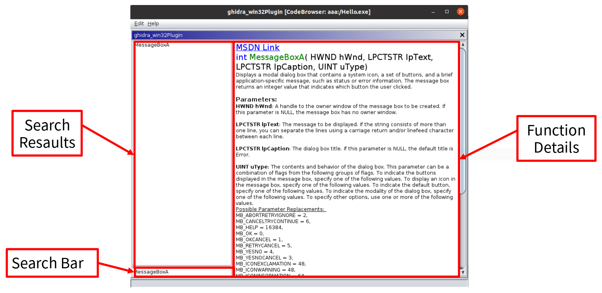
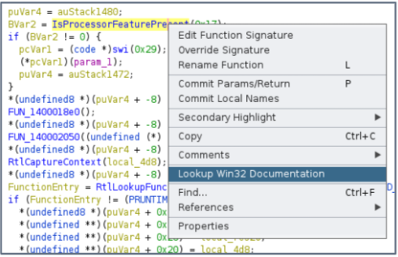
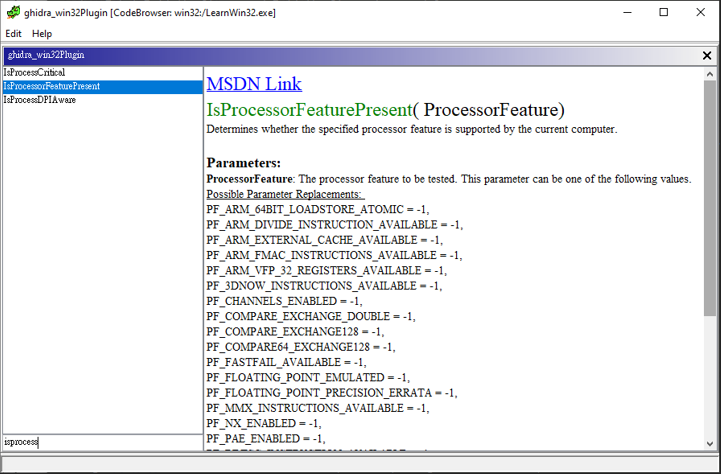

# GhidraLookup Plugin

The GhidraLookup plugin aims to help user lookup documentations of Win API functions.

## Features

### Analyzer

GhidraLookupAnalyzer can analyze every Win32 API calls and sets Equates to constants.

- Before

- After

### Documentation Lookup

## Usage

Right click on a Function in the *Decompile Window*, if the function is part of the Win32 API, the option `Lookup Win32 Documentation` would be available.

Clicking on the option brings up the documentation window. It displays the function signature and possible constants for each parameter. You can also reach the MSDN page for this function in your browser by clicking on `MSDN Link`. In the bottom left panel we can type and search for a specific Win32 function.

## Installation

1. [Download](https://github.com/XYFC128/GhidraLookup/releases) this plugin.
2. Move .zip file to `<Your Ghidra Installation Directory>/Extensions/Ghidra/`
3. In Ghidra : **File** -> **Install Extensions** -> check **GhidraLookup**
4. Restart Ghidra

## Build

1. Install [Ghidra](https://ghidra-sre.org/InstallationGuide.html)

2.  Install `Eclipse IDE for C/C++ Developers` [Download](https://www.eclipse.org/downloads/packages/)
    
3.  Install PyDev
    
    - select **Help** \> **Install New Software** and enter the following link in the **Work with** section: `http://www.pydev.org/updates`

4.  Install GhidraDev
    
    - Browse to **Help -> Install New Software**
    - Click the **Add** button and then click **Archive**
    - Browse the Ghidra directory **&lt;path&gt;/Ghidra/Extensions/Eclipse/GhidraDev/**, select **GhidraDev-2.x.x.zip**.
    - Click **OK -> Check Ghidra** category
    - Click **Next -> Next -> Finish**
    - Make sure to click **Install anyway** and click **Restart Now**.
    - After restart Eclipse, browse to **GhidraDev** -> **Preferences** -> **Ghidra Installations**
    - Add your Ghidra Installation Directory

5. Use Eclipse open this project
    - **File** -> **Open Project From File System**
    - Enter the project directory in the **Import source** section
    - In the **Package Explorer** right click on this project -> **GhidraDev** -> **Link Ghidra**

6. Create new Launch Configuration
    - **Launch Mode** : Run
    - **Launch Configuration Type** : Ghidra
7. Launch
    - In Ghidra Code Browser **File** -> **Configure** -> **Configure All Plugins** select **GhidraLookupPlugin**

### Todo

- Parameter Constant Substitution for Win32 functions.
- Crawler support for other MSDN pages.
- UI / UX refinement.
